# 2024_2025_5ISS_BOUKOUISS_BIGOT_BRUNETTO_HENRIET_JOBARD_GAS_SENSOR

## Introduction

The objective of the course integrate the sensor design and build at AIME with different wireless protocols, including LoRa IoT protocol, but also nodered and Buetooth via an android application. A work has also be done do have adapt the gas sensor signal, witha  trans impedance amplidfier, and also a didecated shield to plug into the arduino board, to have a fully compact and easy to use system. However, we have not been able to treat much the data, to have a more intelligent system.

   

   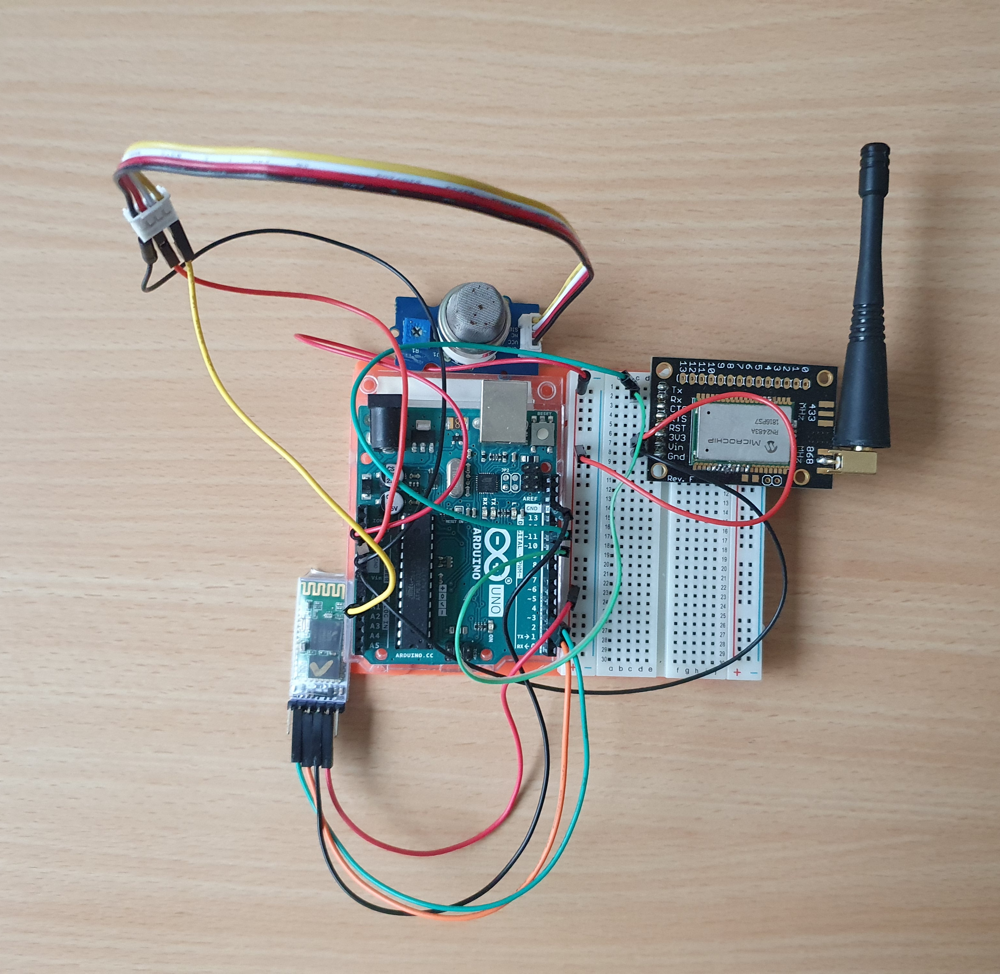
    
   <i>Board Connection</i>
    
   

   

   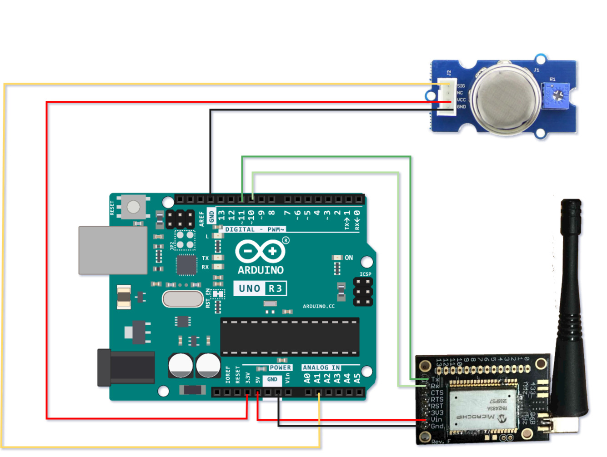
       
   <i>Board Connection</i>
    
   

## LTSpice Simulation

To use our sensor with the arduino board we need first to adapt the signal in order to make it readable for the arduino.This is the objective of this part with LTSpice, adapt the signal within a trans impedance amplifier with multiple filters too. With the sensor we designed at AIME, we are dealing with very low currents and, therefore, very high resistances. This is quite challenging to achieve and often requires expensive equipment. That is why, during the practical sessions, we tried to overcome this difficulty, with a first study of possibilities.

A first solution is to use a direct transimpedance amplifier, but this has a high resistance, is expensive, and is not as precise as desired. Another possibility is to cascade two amplifiers with a bias resistor. The only issue in this case is the energy consumption of the amplifiers, as they are active components. The chosen solution is the use of an amplifier whose only difficulty is that it does not excessively amplify the offset voltage. The LTC1050C meets this condition. It is in fact a trans impedance amplifier. Next, the proposal is to apply different filters:

	- Low-pass filter (passive): to filter high-frequency noise from the sensor
	- Filter (active): to filter ambient 50Hz noise and noise from the amplifier
	- Filter (active): to filter frequencies at the output of the operational amplifier and the ADC to satisfy the Shannon condition

1. Analysis of the trans impedance amplier characteristics

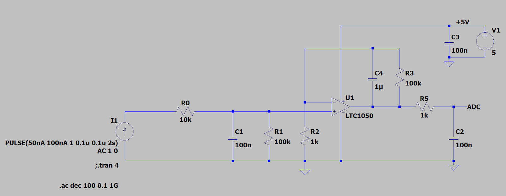
<i>Ltspice transimpedance circuit</i> 
 

  

  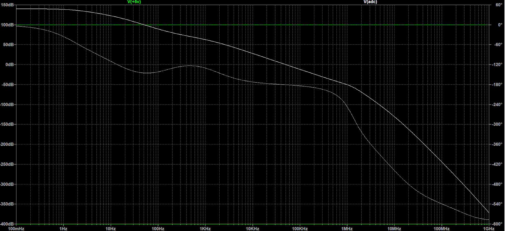
  <i>Bode diagram of the transimpedance circuit</i> 
   
  

  
 
  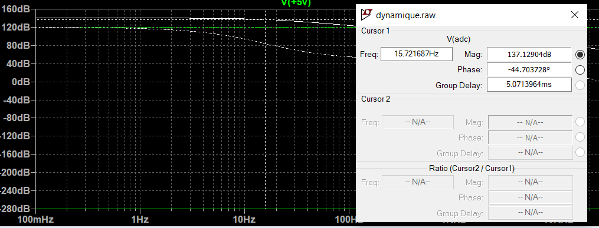
  <i>Identification of the first cutoff frequency</i> 
   
  

  
  
  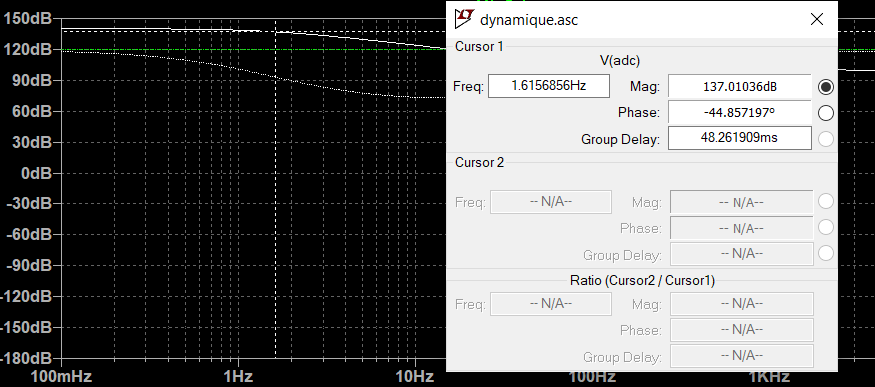
  <i>Identification of the second cutoff frequency</i> 
   
  

   
  
  
  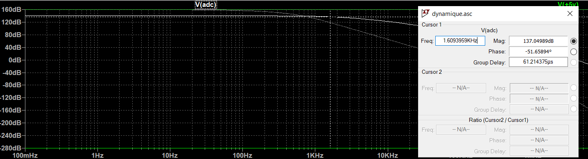
  <i>Identification of the third cutoff frequency</i> 
   
  

  

  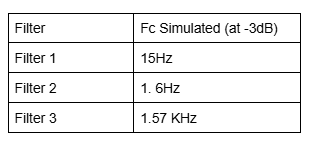
  <i>Cutoff table recap</i> 
   
  

2. Modelisation and simulation of the gas sensor in LtSpice

 

 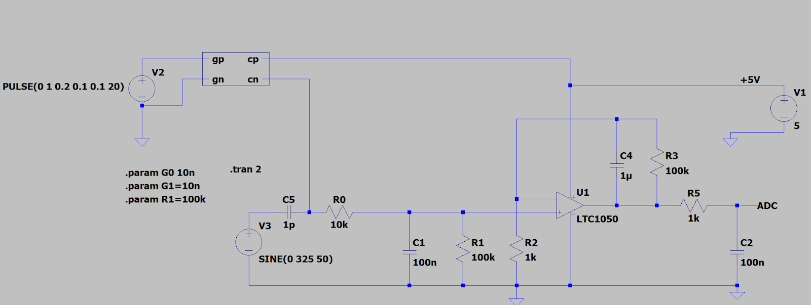
 <i>Inetgration of the sensor model in the previous model</i> 
   
 

 

 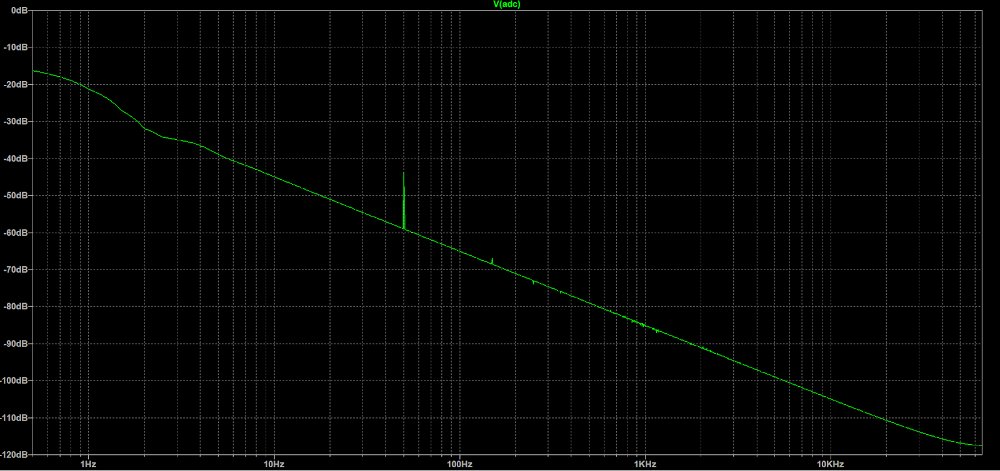
 <i>Bode diagram of the complet system</i> 
  
 

## LoRa Communication and MQTT model

This was for us the first time we used LoRa protocol in a concrete project, wich motivate us even more. The idea is to first connected the gas sensor to the arduino borard, with the objective to send its values to the LoRa gateway place on the rootop of the GEI.

To do, we used the chirpstack website in order to connect the gateway to within the microchip radio device, that is wired to the arduino.

We first identify the microchip references with the arduino code provided above, and set up these parameters on the chirpsatck website, and with the eduroam wifi connection : https://srv-chirpstack.insa-toulouse.fr/#/regions

	const char *appEui = "0004A30B002159CA";
	const char *appKey = "8d1630b9b6db6270fa1ae3268e610842";

	EUI: 0004A30B002159CA
	Battery: 3953
	AppEUI: 0004A30B002159CA
	DevEUI: 0004A30B002159CA

 
	 
 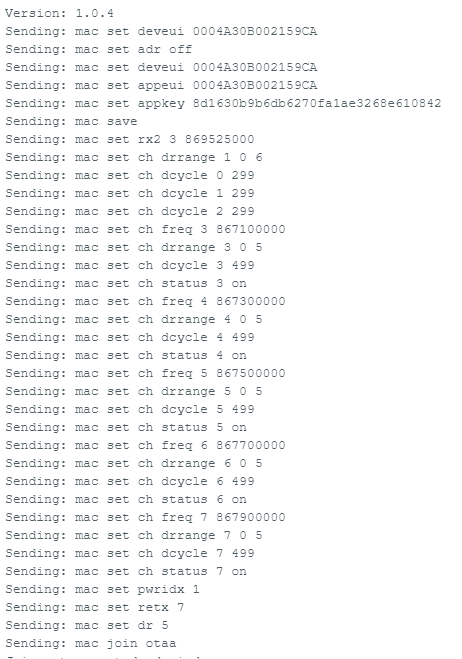
 <i>Device informations of the microchip device</i> 
  
 

 

Once we were connected, we were abl to send packet to the gateway, and see the data  on both of the arduino serial window, and on the chirpstack panel deidcated to use the sensor. We also have on the below image, the link with the nodered website, receiving the data too.

## Display the measured data
Once the data was gathered on Chripstack, we wanted to subscribe and be able to see the data as they get measured.
To proceed, we were able to use two development tools to create user interfaces that would properly work with an MQTT communication: NodeRed and MIT App Inventor.

### Nodered
 
NodeRed is a low-code programming tool. 
Through it's ui add-on, it is possible to make simple interfaces.
We were able to create a web interface subscribed to the MQTT broker, displaying the sensor's data.

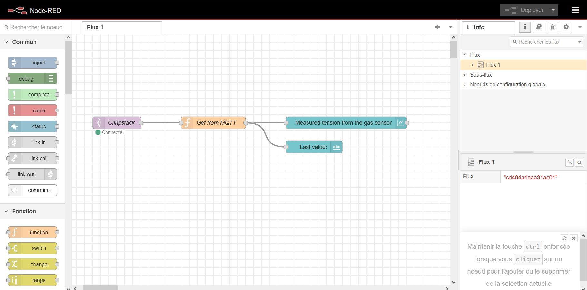
<i>The nodes that compose our program</i> 
 
 

	
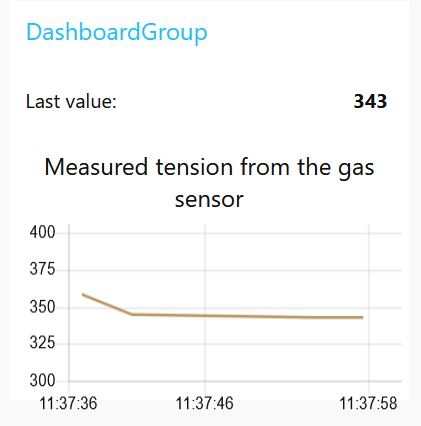
<i>The graph with the measurement from our nodered UI</i>  

 

 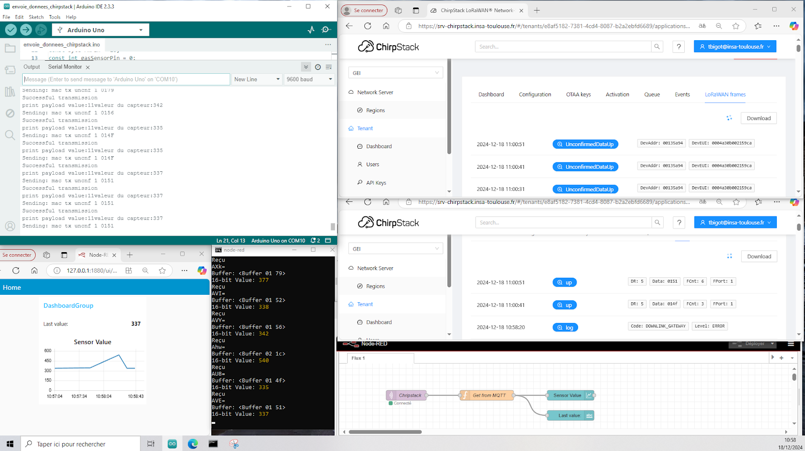
  
 <i>Bode diagram of the complet system</i> 
  
 

### MIT App Inventor

In addition to the MQTT and Node-RED components, we included a section in the Arduino code to communicate the gas sensor information to a phone. To achieve this, we used App Inventor for designing the mobile application. The two tabs, "Design" and "Blocks," allowed us to create an application easily and fairly quickly for receiving the sensor's value.

<b>MIT App Inventor</b> is a free online tool offering a user friendly interface for android application development. 
We first had a small introduction by having a led turning on and off using this tool

 
	 
 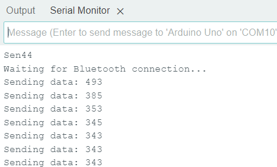
 <i>Data send to the smartphone</i> 
  
 

 
 
 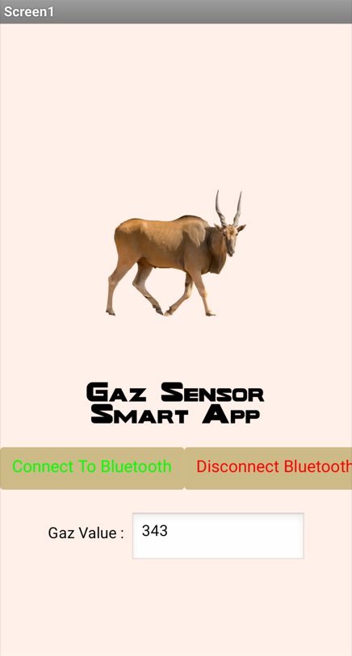
 <i>Data received on the application</i> 
  
 

Due to a lack of time, we were unable to go beyond the simple transmission of data to the smartphone. However, this still allowed us to explore Bluetooth communication between the Arduino and the smartphone.

As an improvement, we considered implementing a graphical representation with real-time updates of the gas level. Although we attempted it, we were not able to successfully implement this functionality. We then tried to create an interface to display the evolution of the resistance, meaning of the state of the air, through a live graph.

Another additional feature we could have explored is phone communication, such as sending an SMS when the gas level goes above or below a certain threshold, to explore another communication protocol.

## PCB ##

cf samia
